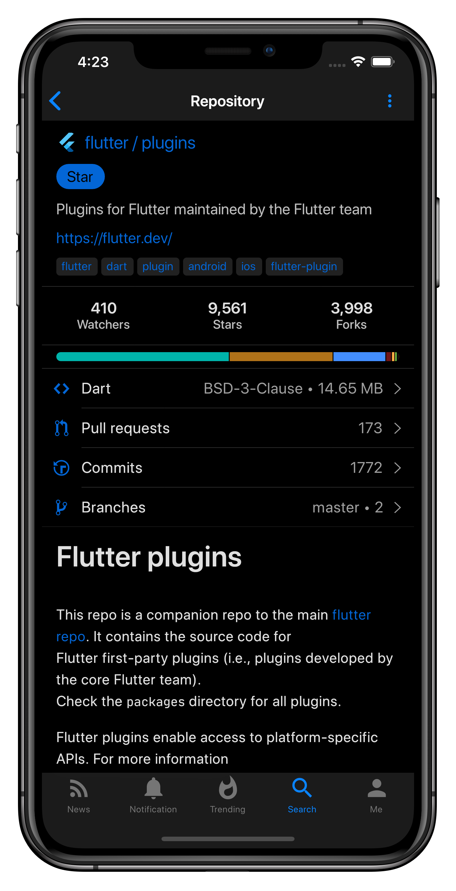
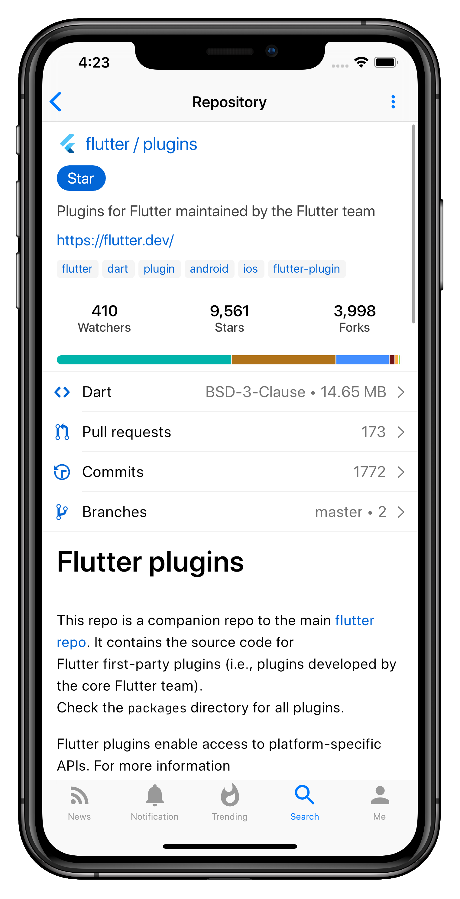

# GitTouch

Open source mobile client for GitHub, GitLab and Gitea, built with Flutter

  
  

## Installation

Click badges above to install it from Apple App Store or Google Play.

Android users can also download APK file from [release page](https://github.com/pd4d10/git-touch/releases) and install it manually.

## Screenshots

  
  

## Contributors

## License

Apache License 2.0
