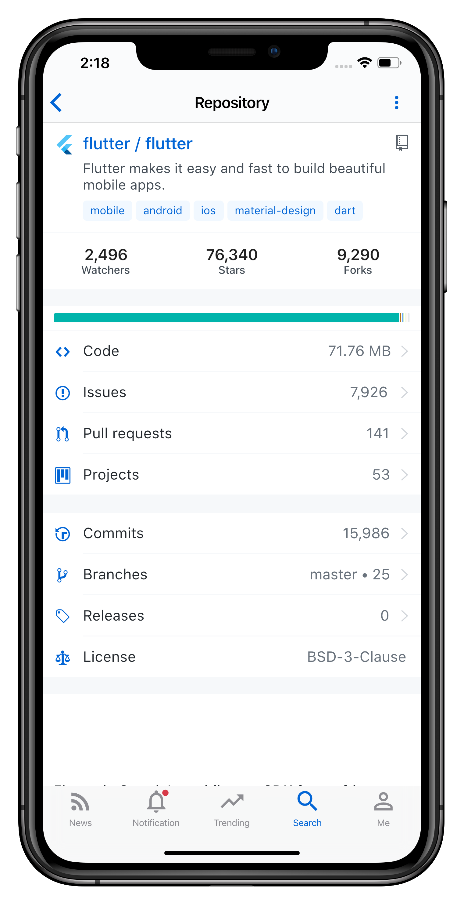
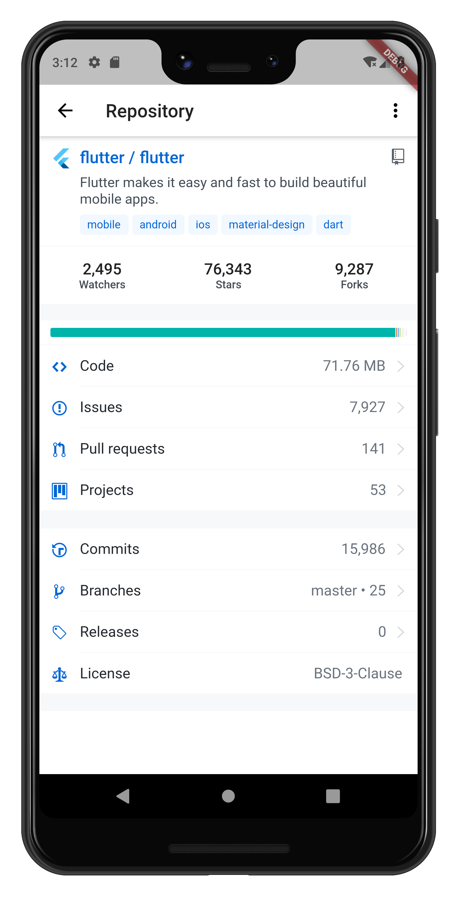

# GitTouch

Open source GitHub client built with Flutter

## Screenshots




## Contributing

### UI Design

GitTouch use Flutter's builtin material and cupertino widgets. If you have any thoughts about UI design, feel free to open an issue to discuss about it.

### Bug report

Please follow the issue template to submit a bug report. Report with a screenshot would be great.

### Bug fixes or new feature

We use Flutter `dev` channel, run following command to switch to it:

```sh
flutter channel dev
```

## Contributors

Thanks goes to these wonderful people ([emoji key](https://allcontributors.org/docs/en/emoji-key)):

<!-- ALL-CONTRIBUTORS-LIST:START - Do not remove or modify this section -->
<!-- prettier-ignore -->
<table><tr><td align="center"><a href="https://github.com/pd4d10"><br /><sub><b>Rongjian Zhang</b></sub></a><br /><a href="https://github.com/pd4d10/git-touch/commits?author=pd4d10" title="Code">💻</a></td></tr></table>
<!-- ALL-CONTRIBUTORS-LIST:END -->

This project follows the [all-contributors](https://github.com/all-contributors/all-contributors) specification. Contributions of any kind welcome!

## License

MIT
